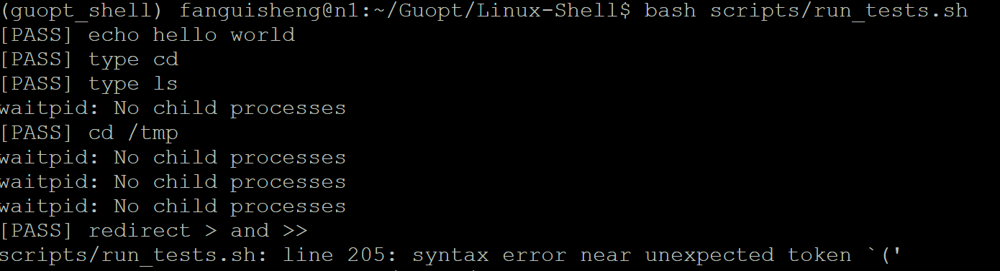
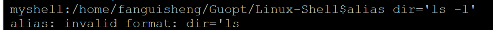
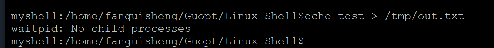
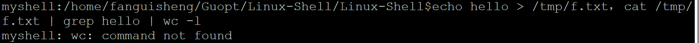

1. 自动化测试问题（已修复）

2. tab补全有问题，按一次tab没有补全，按两次后再按一次tab会显示所有文件名（已修复）

3. 没有创建别名的测试（已修复）

4. 重定向功能有问题（已修复）

5. 补全的测试用例建议改一下，改成his[tab]，因为ca[tab]不只有一种（已修复）

6. 管道的第二个测试错了（已修复）

7. sleep没有实现（也没说一定要实现，考虑一下要不要做）（已修复）

